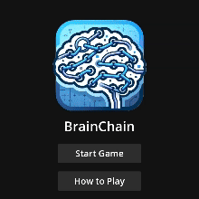

# BrainChain

BrainChain is a word association game where players create chains of related words. Each word must have a meaningful connection to the previous word, whether through compound words, strong associations, or indirect relationships via common connecting words.

## Demonstration

